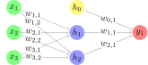

>Hello, my name is Carlos Raul. I am a 19 year old physics undergraduate student at UNMSM with a strong passion for higher education in the field of mathematical-computational modeling of physical phenomena. As a proactive individual, I believe that hard work and dedication can go a long way in achieving one's goals. :D

## Research Interests

- Mathematical and computational modeling.
  ### $ \frac{\partial (\rho u_{i})}{\partial t} + \frac{\partial[\rho u_{i}u_{j}]}{\partial x_{j}} = -\frac{\partial p}{\partial x_{i}} + \frac{\partial \tau_{ij}}{\partial x_{j}} + \rho f_{i} $
  
- Computer Simulation

  

- Machine Learning 

  

- Linux 

<!-- I was a graduate student working with [Daniel Whiteson](https://www.physics.uci.edu/people/daniel-o-whiteson) at the University of California at Irvine from 2015-2021. I am now actively searching for new opportunities in industry -->