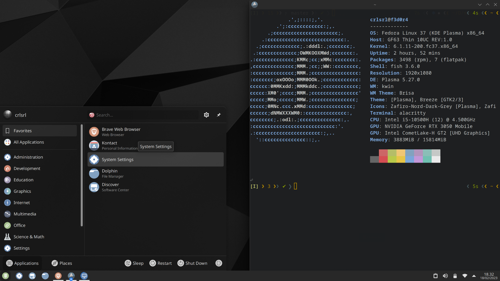

## Installation of Fedora Scientific

 

Reluctant to reinstall all of your tools for scientific and numerical work? Here is the solution. Fedora Scientific brings together the most useful open-source tools from the scientific and numerical computing world with the wonders of the KDE desktop environment. With the recent installation of Fedora Scientific on my MSI laptop, I have been able to experience the benefits of having all the tools I need for my work in one place.

Fedora Scientific includes a large number of applications and libraries such as the GNU Scientific library or SciPy, tools such as Octave or xfig, composition or graphic programs such as Kile or Inkscape... The current set of packages includes development environments, tools, and libraries for programming in C, C++, Python, Java, and R, with elements for parallel programming such as OpenMPI and OpenMP. Typographical composition tools, writing, and publication are also available.

In addition, my experience with the KDE desktop environment has been excellent, with a large amount of customization and an intuitive interface. The integration of scientific and numerical tools with a solid and customizable desktop environment is a winning combination for anyone working in data calculation and analysis.

In conclusion, the installation of Fedora Scientific on my MSI laptop has been an excellent decision, and I am sure it will be a great help in my long-term work. If you are looking for a complete and efficient solution for your scientific and numerical needs, Fedora Scientific is an excellent option.

## Instalación de Fedora Scientific en una laptop MSI

Receloso de reinstalar todas sus herramientas para trabajo científico y numérico? Aquí tiene la solución. Fedora Scientific reune las herramientas más útiles de código abierto del mundo científico y de cálculo numérico con las maravillas del entorno de escritorio KDE. Con la reciente instalación de Fedora Scientific en mi laptop MSI, he podido experimentar las bondades de tener todas las herramientas que necesito para mi trabajo en un solo lugar.

Fedora Scientific incluye gran cantidad de aplicaciones y bibliotecas. Bibliotecas como GNU Scientific library o SciPy, herramientas como Octave o xfig, programas de composición o gráficos como Kile o Inkscape... En el conjunto actual de paquetes hay entornos de desarrollo, herramientas y bibliotecas para programar en C, C++, Python, Java y R, con elementos para programación en paralelo como OpenMPI y OpenMP. También están disponibles herramientas de composición tipográfica, escritura y publicación.

Además, mi experiencia con el entorno de escritorio KDE ha sido excelente, con una gran cantidad de personalización y una interfaz intuitiva. La integración de herramientas científicas y numéricas con un entorno de escritorio sólido y personalizable es una combinación ganadora para cualquier persona que trabaje en cálculo y análisis de datos.

En conclusión, la instalación de Fedora Scientific en mi laptop MSI ha sido una excelente decisión, y estoy seguro de que será una gran ayuda en mi trabajo a largo plazo. Si estás buscando una solución completa y eficiente para tus necesidades científicas y numéricas, Fedora Scientific es una excelente opción.
